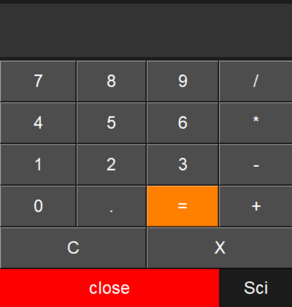
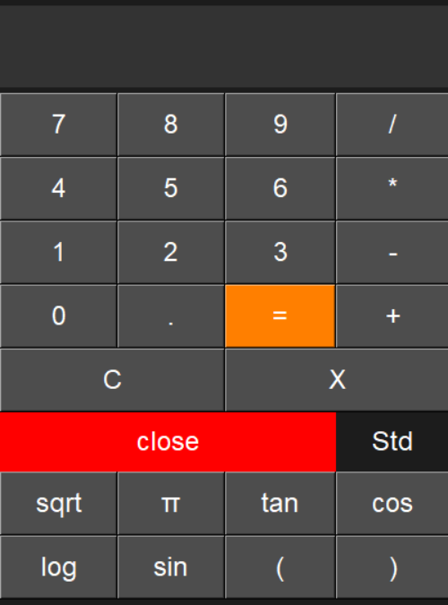

<h1 align="center">🧮Simple Scientific Calculator</h1>
<h3 align="center">A simple but cool scientific calculator built with Python Tkinter</h3>


<p align="left">
  <a href="https://github.com/tushar05v/Simple-scientific-calculator/stargazers">
    
  </a>
  <a href="https://github.com/tushar05v/Simple-scientific-calculator/network/members">
    
  </a>
  <a href="https://github.com/tushar05v/Simple-scientific-calculator/issues">
    
  </a>
</p>


---

### 🚀 Features
- Standard arithmetic operations ➕ ➖ ✖️ ➗  
- Scientific functions: `sqrt`, `sin`, `cos`, `tan`, `log`  
- Constant `π`  
- Clear (`C`) and backspace (`X`) buttons  
- Switch between **Standard** and **Scientific** modes  
- Smooth animated window resizing  

---

### 🛠️ Languages and Tools
<p align="left"> 
  <a href="https://www.python.org" target="_blank" rel="noreferrer"> 
     
  </a> 
  <a href="https://docs.python.org/3/library/tk.html" target="_blank" rel="noreferrer"> 
     
  </a> 
</p>

---

### 📂 Project Structure
```text
scientific-calculator/
│
├── main.py          # Tkinter UI and event handling
├── calc_logic.py    # All math operations
├── requirements.txt # Python version requirement
├── README.md        # Project documentation
└── img/             # Screenshots and images
    ├── std.png
    └── sci.png
```
### 📸 Screenshots

**Standard Mode**  
  

**Scientific Mode**  


